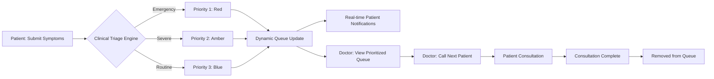
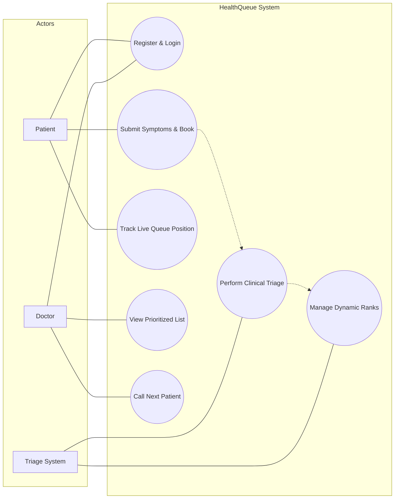
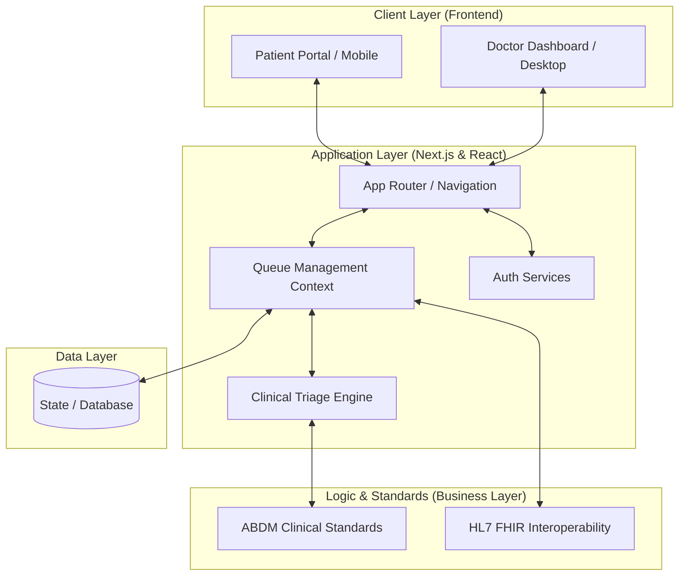

# 📊 HealthQueue: Diagrams

This document contains the process flow and use-case diagrams for the **HealthQueue** system.

## 🔄 Process Flow Diagram

The process flow illustrates how a patient moves through the system, from initial symptom submission to consultation completion.

---

## 👥 Use Case Diagram

The use-case diagram defines the interactions between the different actors (Patient, Doctor, and System) and the core functionalities of HealthQueue.

---

## 📋 Role Definitions

| Actor | Responsibilities |
| :--- | :--- |
| **Patient** | Registers, provides medical symptoms, and monitors their position in the queue digitally. |
| **Doctor** | Accesses the live triage list, manages patient call-outs, and provides medical care based on priority. |
| **Triage System** | Automatically sorts patients based on clinical severity (ABDM standards) and maintains a dynamic queue. |

---

## 🏛️ Architecture Diagram

The system follows a modern N-tier architecture, leveraging **Next.js** for both the frontend and application logic, with a focus on real-time state synchronization via the **React Context API**.

### 🧱 Component Breakdown

1.  **Client Layer**: Responsive web interfaces tailored for two distinct experiences: heavy data interaction for doctors and quick, intuitive symptom submission for patients.
2.  **Application Layer**: 
    - **Queue Management Context**: Acts as the "Single Source of Truth," managing state across the entire application.
    - **Clinical Triage Engine**: The core algorithm that processes patient symptoms and assigns priority levels.
3.  **Logic & Standards**: Ensures the system remains compliant with national (ABDM) and international (HL7 FHIR) healthcare data standards.
4.  **Data Layer**: Responsible for persistent storage and the integrity of the dynamic triage records.

