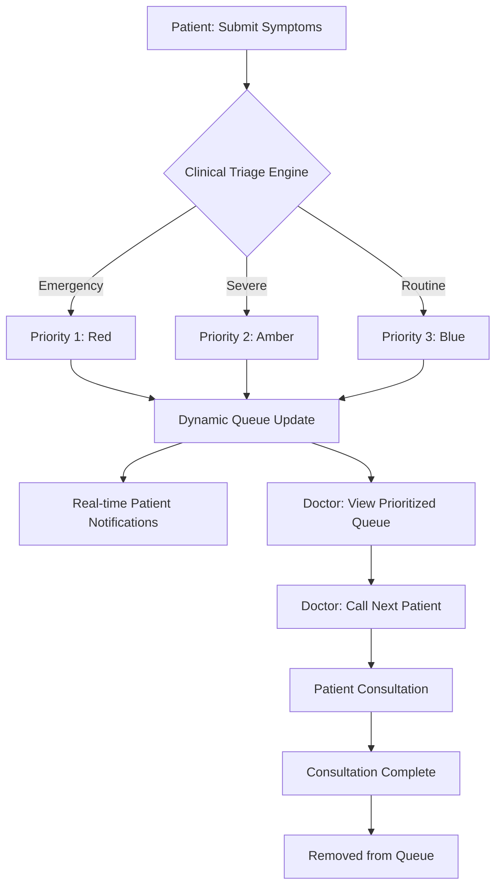
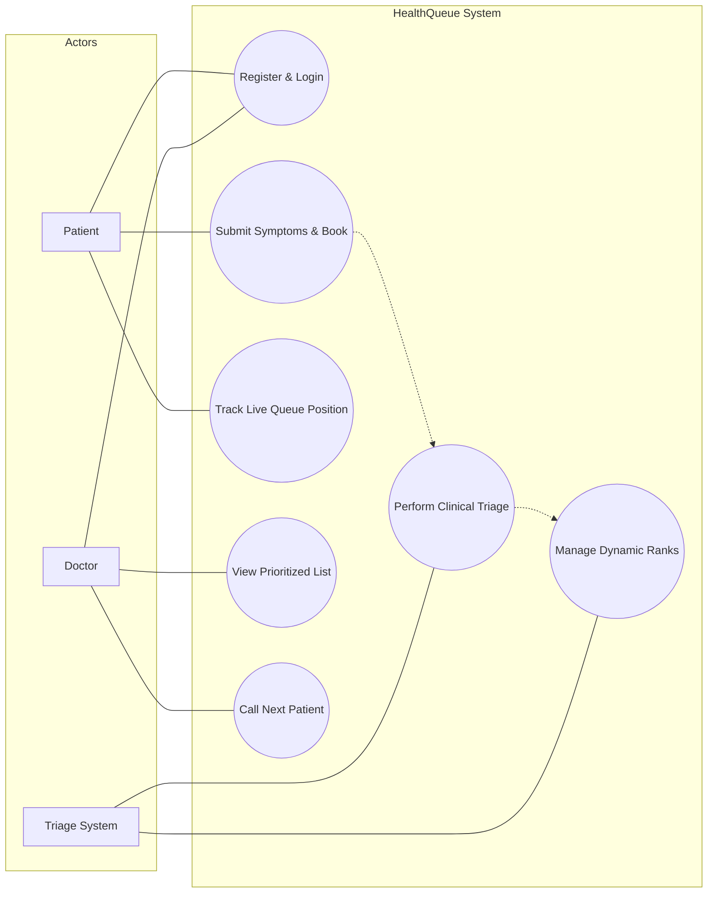

# 📊 HealthQueue: Diagrams

This document contains the process flow and use-case diagrams for the **HealthQueue** system.

## 🔄 Process Flow Diagram

The process flow illustrates how a patient moves through the system, from initial symptom submission to consultation completion.

---

## 👥 Use Case Diagram

The use-case diagram defines the interactions between the different actors (Patient, Doctor, and System) and the core functionalities of HealthQueue.

---

## 📋 Role Definitions

| Actor | Responsibilities |
| :--- | :--- |
| **Patient** | Registers, provides medical symptoms, and monitors their position in the queue digitally. |
| **Doctor** | Accesses the live triage list, manages patient call-outs, and provides medical care based on priority. |
| **Triage System** | Automatically sorts patients based on clinical severity (ABDM standards) and maintains a dynamic queue. |
